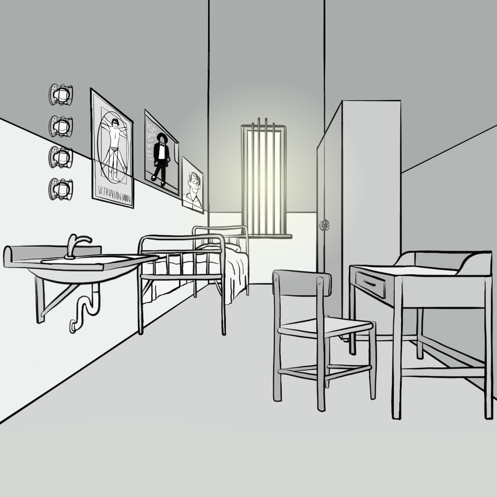
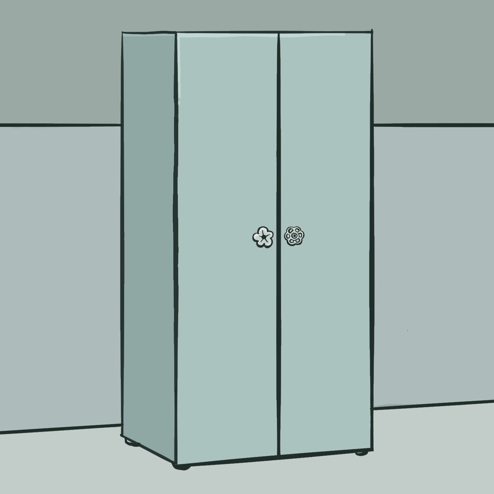
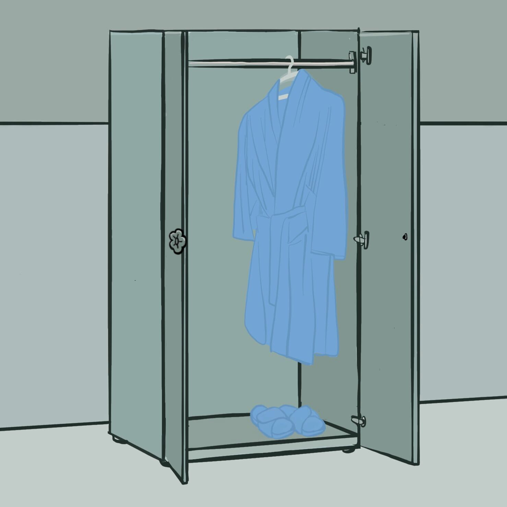
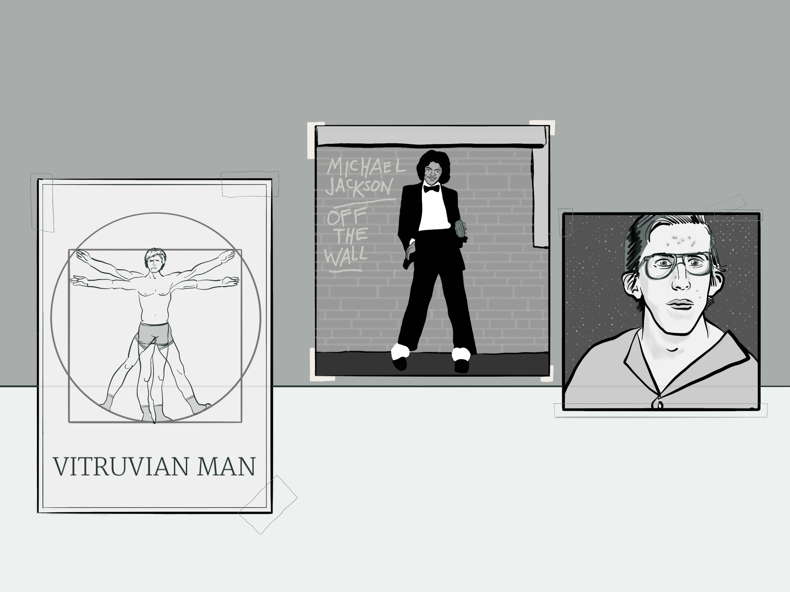
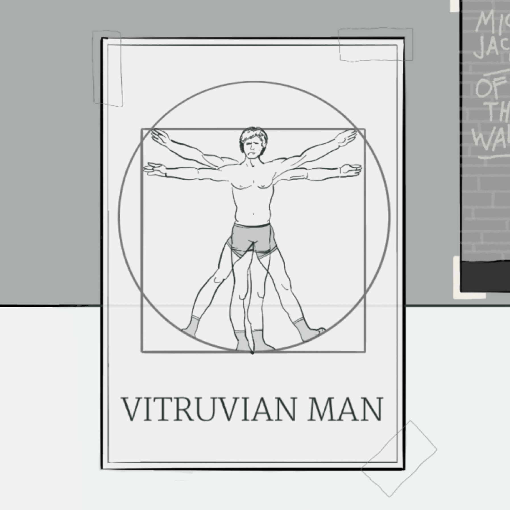
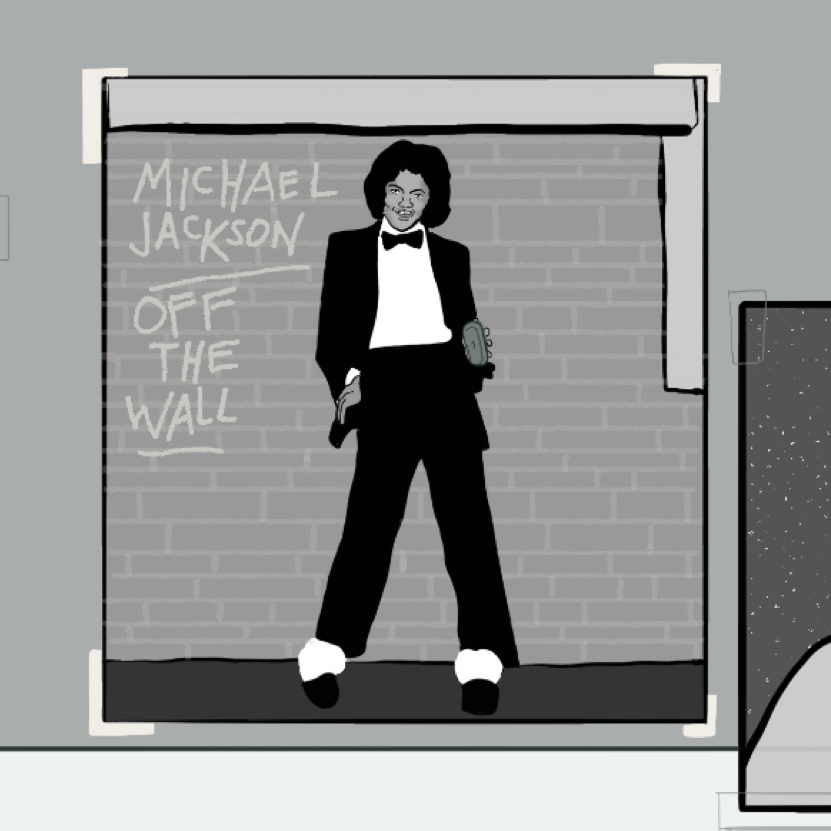
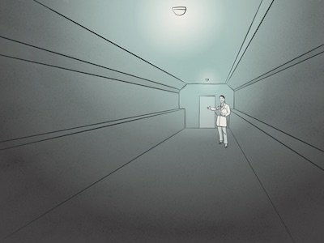

Treatment for:
“Escape From Bell Hill” (Asylum #6) VERSION 2

Commands: look, get, use, use x with y, talk to, ask about, sleep, open, close, wash, do, inventory

You accept an invitation to playtest a new physical escape room. The setting of the game is a mental asylum called "Bell Hill".

Having signed the game’s online terms & conditions and a standard NDA, you climb into bed early Friday night, full of anticipation.

After all, you love escape rooms.

> sleep

# prologue

Saturday morning, you arrive at the venue and are greeted by a female host wearing a white lab coat. After placing your belongings in a locker, you are led down a long hallway to a simple bedroom. In the game, you will play the role of a male inmate of Bell Hill. Your goal is to escape the asylum.

> ask about time

The host informs you the game will last one hour, followed by a short debrief. If you are ever stuck or want to leave, just say the safe word “MACARONI”.

She wishes you good luck and exits through the door by which you came. It closes seamlessly, becoming part of a blank wall of the room.

> look room

You have just begun to examine your surroundings when the *real* door of the room opens, and two burly men dressed as what you take to be orderlies enter.

> talk to orderlies

Before you can speak, one of the orderlies locks you in bear-like grip while the other strips your pants off your legs. Your shirt is torn off next, leaving you only in your underwear and socks.

> ask about clothes

“Is this part of the game?!” you stammer angrily.?

“It’s all in the terms and conditions,” says the first orderly.

“Looking forward to your escape attempts!” chuckles the other, following his partner out.

“Geesh,” you think, “That’s maybe a bit much…”

The door shuts with a resounding click.

! [img: inmate’s bedroom – power on – no lights]
! [img: inmate’s bedroom – power on – one light]
! [img: inmate’s bedroom – power on – two lights
! [img: inmate’s bedroom – power off – three light]
! [img: inmate’s bedroom – power on – four lights]

# Cell

You are in an inmate’s bedroom.

You see a bed, a wardrobe, a desk, a sink, a window, a door, lights, and posters.

> look bed

You see a pillow, a mattress, and a bedsheet.

> look pillow

There is a bar of soap inside the pillowcase. Was this room the location of a code
red?

OR Just an ordinary, head-stained pillow.

> look mattress

Thin and uncomfortable looking.

> get mattress

You don’t need it.

> look bedsheet

Thin and… stained. Yuck. A bit too much naturalism.

> get bedsheet

You don’t need it.

> look soap

You don’t see anything of interest.

OR You don’t see that here. if “look pillow” and/or “get soap” hasn’t been input
previously.

> get soap

Taken.

OR You already have the bar of soap.

> look wardrobe

! [img: wardrobe – closed]
! [img: wardrobe – open – bathrobe - sandals]
! [img: wardrobe – open – bathrobe]
! [img: wardrobe – open - sandals]
! [img: wardrobe – open – empty]

Cheaper than the one your remember from your college dorm. It has two narrow doors with rounded handles that look like flower petals.

You see a bathrobe and sandals.
You see a bathrobe.
You see sandals.

> look handles

! [img: wardrobe – handles]
! [img: wardrobe – handle missing]

Upon closer inspection, something **looks odd** about one of the handles.

OR You have removed one of the handles.

> open wardrobe/use handle

The wardrobe is now open.

> close wardrobe/use handle

The wardrobe is now closed.

> get bathrobe

Worn.

TRIGGER #1 (if sandals also worn)

> look bathrobe

It is blue.

OR You don’t see that here. if wardrobe is closed and/or bathrobe hasn’t been
taken.

> get sandals

Worn.

TRIGGER #2 (if bathrobe also worn)

> look sandals

They are translucent blue, and made of rubber.

OR You don’t see that here. if wardrobe is closed and/or bathrobe hasn’t been taken.

> get handle

Taken.

OR You already have the handle.

> look desk

A simple wooden desk with a single front drawer and a flat writing surface.

> look sink

The faucet handle is missing.
You see a handle.

> use handle with sink

You replace the faucet handle.

> look handle

 You see nothing out of the ordinary.

> get handle

 you remove the faucet handle.

> use sink/use handle

There is no handle.

AND/OR You don’t have any soap.

ELSE You can now **wash** yourself.

> wash hands, neck, ears, face

TRIGGER #4

ELSE There is no handle.

AND/OR You don’t have any soap.

OR if order of washing is incorrect The voice crackles sternly over the speaker. “Now Jack. That’s not the way mother taught you.”

> look window

The window is frosted and protected by metal bars from your side. Upon closer inspection, you notice that the unnatural **yellow light** from without is pulsing slightly, with the faint electrical buzz of artificial lighting.

> look door

It’s locked tight. Will you be able to escape?

> open door

It’s locked tight. Will you be able to escape?

OR Now unlocked, the door opens freely into a white hallway. if TRIGGER #5 is initiated

TRIGGER #6

> look lights

! [img: lights – none]
! [img: lights – one]
! [img: lights – two]
! [img: lights – three]
! [img: lights – four]

Apart from the diffuse light coming through the window, these green bulbs appear to be the only other source of light in the room.

> look posters

# Posters

You see a drawing, a poster, and a photo.

> look drawing

! [img: drawing – Vitruvian Man]

It’s a reproduction of DaVinci’s classic drawing, “Vitruvian Man,” except the figure looks a lot like you at the moment.

> look poster

You remember this album cover from childhood. However, you don’t remember Michael holding a bar of soap in it.

> look photo

It’s you, from your senior year in high school, complete with forehead acne and love goggles. How did they manage to make a copy of this? Unnerving.

> get poster

You take the poster *off the wall.*

> look poster

You turn the poster over to see the following scrawled in black Sharpie:

Four good boys in turns did wash
First was Hans (hands) the boy from Ansbach
Next was Nick (neck) with ruddy skin
While Piers (ears) did follow after him
The last was Fez (face) a swarthy chum
He did the deed then all were done.

> do 18 jumping jacks

You slip out of your blue sandals and perform 18 jumping jacks in your socks and underwear. You can’t remember doing these since childhood.

It’s rather fun, actually.

TRIGGER #3

> use sandals with window if TRIGGER #4 is initiated

TRIGGER #5

ELSE Nothing unusual happens.

OR You don’t have that.

TRIGGER #1 (after 4 initial inputs)
Before you can do so, a voice crackles over a hidden speaker in the room. “To proceed to breakfast, please follow your morning routine. Remember, every good boy dresses sharply.”

TRIGGER #2
The top bulb in a column of four has come on, now glowing a bright green above the others.

The same voice crackles over the speaker. “That’s a good boy, Jack. Now remember, exercise makes the man. Just as many times as there are legs in the room.”

TRIGGER #3
The second in the column of five green lightbulbs lights up.

The invisible speaker crackles. “Well done, young Jack. You’re fit as a fiddle. And now it’s time for all good boys to scrub away those mean, nasty germs. Let’s not be careless, now. Follow proper procedure.”

TRIGGER #4
The third green light in the column above the sink turns on.

The voice is encouraging this time. “Jack, my boy, you’re a wonderful lad. Limber and loose and clean as a goose. And dressed up so nicely to boot!

> ask about my real clothes

! [img: inmate’s bedroom – power off – three light]

Suddenly, there is a deep crack, and all the lights drop out in the facility. All that remains is the artificial yellow glow from outside your window and the three illuminated green lightbulbs above the sink.

> ask about those terms and conditions

“Jackkkk…” The voice is faint and eerie, like a record being played at the wrong speed. “I’mmm envioussss of youuu Jackkk. Soooo envioussss of youuu. My envyyy is fillinggg thisss roooom. Fillll it with meee Jackkk… fill thisss roooom with envyyyyy.”

TRIGGER #5
You remove the sandals and lift them to the window. Immediately, their light blue color is transformed to green by the yellow light without.

The fourth and final green lightbulb above the sink blinks on, followed by a resounding crack.

The lights of the facility pulse as they come on once again.

 > use sandals

You put the sandals on once again.

You hear a loud click from the bedroom door.

TRIGGER #6
> exit room

# Epilogue

You step into the hallway, pleased with your accomplishment.

At the far end you see a young woman hobbling toward you. She appears to be bleeding.

 “Don’t let them fool you,” she moans.

 “Okay,” you think to yourself. “Maybe this is a bit much for a Saturday morning…”

 The orderlies appear behind her.

> ask woman about game

“This isn’t a game…” she gurgles.

“Without a moment’s hesitation, one of the orderlies draws a handgun and fires three quick rounds. The deafening cracks of each roll and echo around the hallway sickeningly as you watch her collapse in a pool of… fake blood?

“Okay. You’ve had enough. This isn’t fun.

> macaroni

ELSE How do you tell them you’ve had enough?

You see the host in the lab coat who welcomed you taking furious notes on a clipboard at the end of the hallway.

Maybe she didn’t hear you.

> macaroni

ELSE Did she hear you say “macaroni?”

The woman only looks at you and continues writing.

> macaroni

ELSE Say it again!

The woman looks up at you wanly and motions to the orderlies.

”This man is having delusions of being in an Italian restaurant,” she says. “He is clearly insane. Take him to *the tower*.”

The men advance on you.

> use sandals on orderlies

The lights in the facility drop out with a heavy crack, and the hallway is bathed in sickly green light. The rough hands of the orderlies grab you and drag you in the opposite direction of the host.

> macaroni…

As you disappear deeper into the asylum, you hear her call out.

 “You should have read the terms and conditions more carefully, Jack.”

Welcome to Bell Hill!

----
Debugging shortcuts

Locations:
- [prologue](#prologue)
- [Cell](#cell)
- [Posters](#posters)
- [Epilogue](#epilogue)

