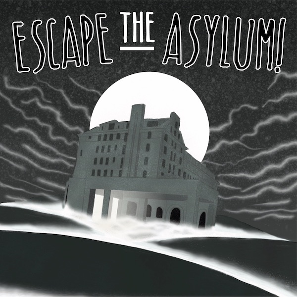
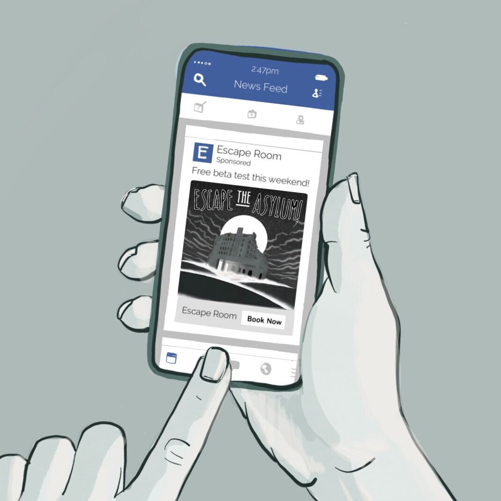
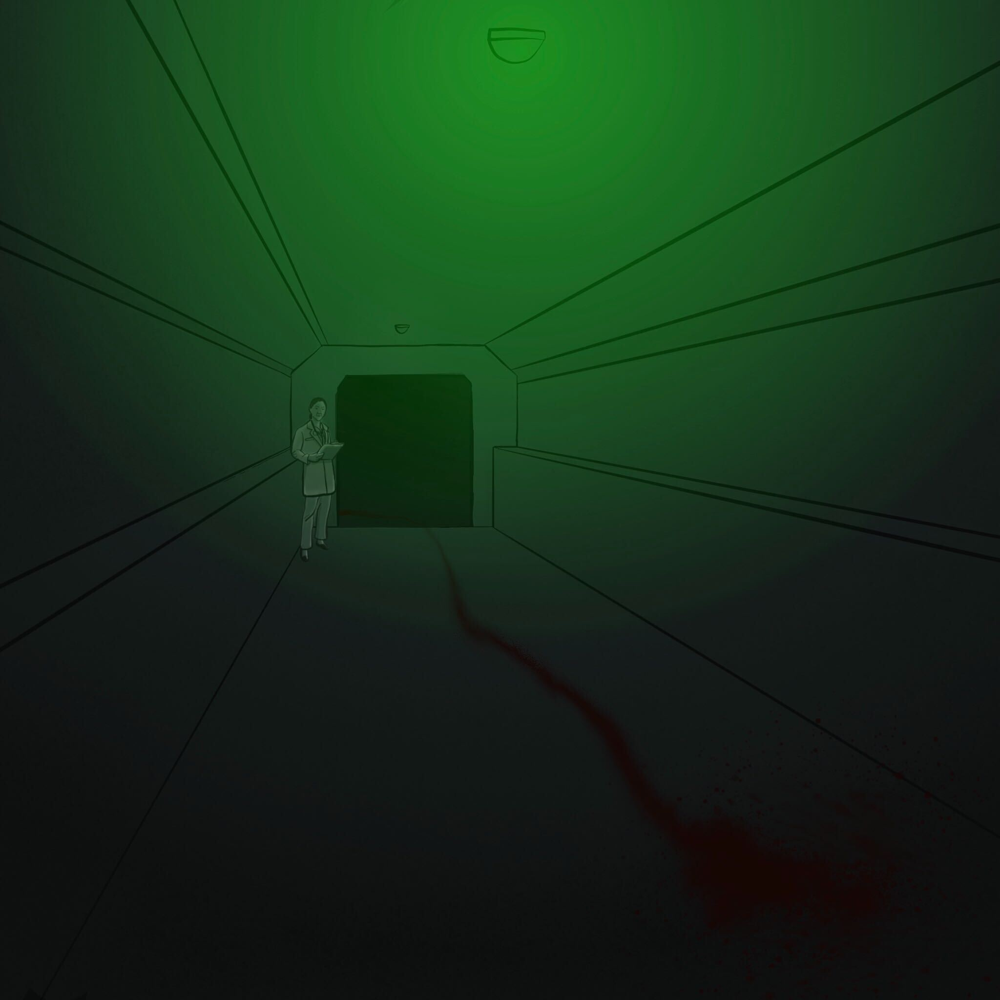
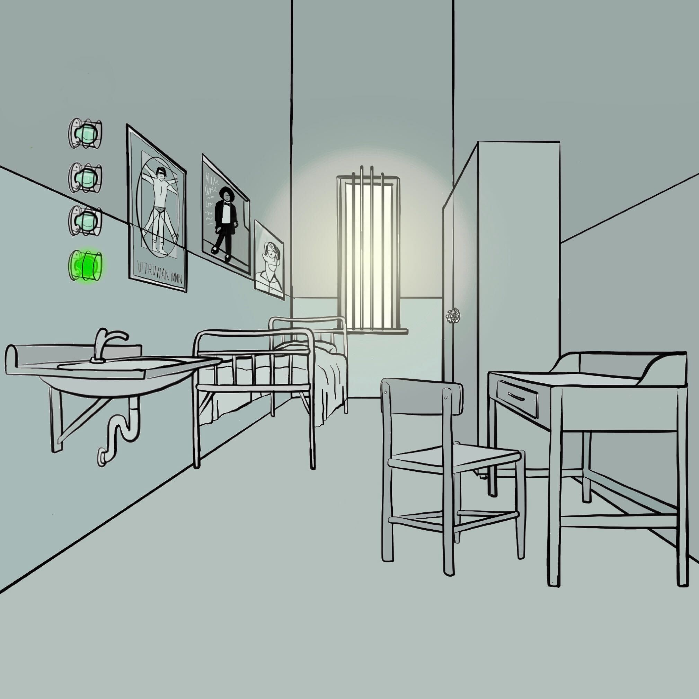

# Start



# Escape the Asylum!
An interactive fiction thriller developed for Slack
Copyright (c) 2020

# Home

You accept an invitation to playtest a new physical escape room. The setting of the game is a mental asylum called "Bell Hill".

What do you want to do?

  - [Surf Facebook](#surf-facebook)
  - [Corridor](#corridor)
  - [Go to cell](#cell)


## Surf Facebook


You continue surfing facebook some more...


## Corridor



you enter the corridor

> ask about clothes

“Is this part of the game?!” you stammer angrily
“It’s all in the terms and conditions,” says the first orderly


## Cell




You're inside a cell, there are some lighst on the wall


> quote

some more

```yaml
- if:
	- something
- then
	- quote
```


----

## Debugging


  - [Go Home](#home)
  - [Start](#start)
  - [Corridor](#corridor)
  - [Cell](#cell)
  - 

